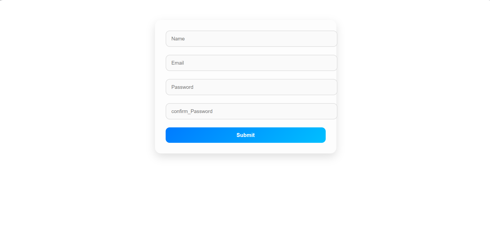

cat > README.md << 'EOF'
# 📝 Form Validation App  

A modern **Form Validation Application** built with React.js.  
This project demonstrates **real-time validation, dynamic error messages, and responsive UI design**.  

---

## 📸 Preview  
  

---

## 🗂️ Project Structure  
form-project/  
├── public/              # Static assets  
├── src/                 # React source files  
│   ├── components/      # Reusable UI components  
│   │   └── Form.jsx     # Main form component  
│   ├── form.css         # Styling for form  
│   └── main.jsx         # Entry point  
├── package.json         # Project dependencies  
├── vite.config.js       # Vite configuration  
└── README.md            # Documentation  

---

## ⚙️ Frameworks & Tools  
- **React.js** → Component-based UI development  
- **JavaScript (ES6+)** → Validation logic  
- **CSS3** → Modern styling & responsiveness  

---

## ⚡ Features  
- ✅ **Live validation feedback** for user input  
- ⚠️ **Dynamic error messages** with fade-in animation  
- 🎨 **Stylish card-based UI design**  
- 📱 Fully **responsive layout** for all devices  
- ✨ Smooth **hover and focus animations**  

---

## 🧩 Validation Rules  
- **Name** → Must be at least 8 characters  
- **Email** → Must include `@gmail`  
- **Password** → Minimum 8 characters  
- **Confirm Password** → Must match password  

---

## 😎 Learning Outcomes  
🔑 Improved understanding of **React state management** with `useState`  
💡 Practiced **conditional rendering and validation**  
🎨 Learned **modern CSS effects** (box shadows, transitions, animations)  
🛠️ Hands-on with **form handling in React**  

---

## 🚀 How to Run  

```bash
# Clone the repository
git clone https://github.com/your-username/form-validation-app.git  

# Navigate into the project
cd form-validation-app  

# Install dependencies
npm install  

# Run the app
npm run dev  

---
```
##👨‍💻 Author

Crafted with focus and creativity by Abdullah Arif